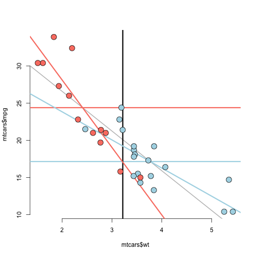
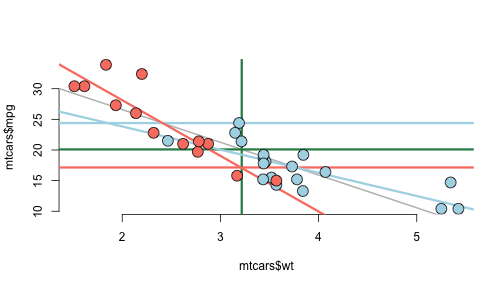
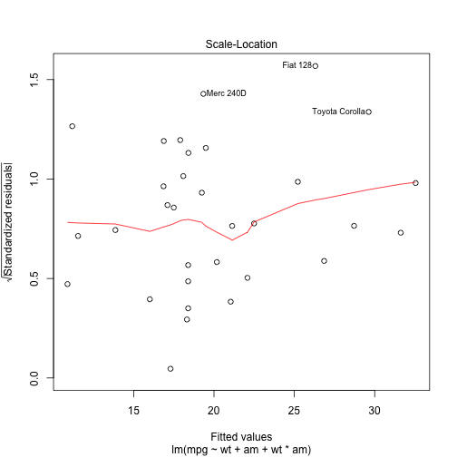
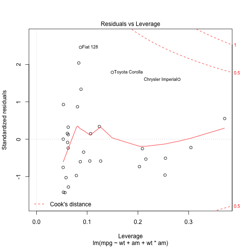

 


```r
dfb <- dfbetas(fit)

levIc <- max(abs(dfbetas(fit)[,1]))
levSlope <- max(abs(dfbetas(fit)[,2]))

dfb[abs(dfb[,1]) == levIc]
```

```
## [1] -0.8240055  0.9300951  0.5836215 -0.5057988
```

```r
dfb[abs(dfb[,2]) == levSlope]
```

```
## [1] -0.8240055  0.9300951  0.5836215 -0.5057988
```

```r
dfb
```

```
##                       (Intercept)            wt            am
## Mazda RX4           -4.595843e-16  4.647076e-16  1.265474e-02
## Mazda RX4 Wag       -2.562764e-16  2.680070e-16 -3.641160e-02
## Datsun 710           1.018035e-16 -5.182689e-17 -7.686677e-02
## Hornet 4 Drive       1.890251e-01 -1.513008e-01 -1.338815e-01
## Hornet Sportabout    1.776976e-02 -1.239790e-02 -1.258586e-02
## Valiant             -1.199280e-02  8.199594e-03  8.494185e-03
## Duster 360          -1.565932e-01  9.055413e-02  1.109109e-01
## Merc 240D            4.926654e-01 -3.980425e-01 -3.489420e-01
## Merc 230             3.256188e-01 -2.666620e-01 -2.306273e-01
## Merc 280             4.674085e-02 -3.261093e-02 -3.310532e-02
## Merc 280C           -3.426993e-02  2.391001e-02  2.427249e-02
## Merc 450SE          -7.029513e-03  1.447029e-02  4.978820e-03
## Merc 450SL           1.220762e-04 -2.538091e-05 -8.646335e-05
## Merc 450SLC         -3.223184e-02 -2.592800e-03  2.282897e-02
## Cadillac Fleetwood   2.299808e-01 -2.613788e-01 -1.628894e-01
## Lincoln Continental  1.172773e-01 -1.317060e-01 -8.306443e-02
## Chrysler Imperial   -8.240055e-01  9.300951e-01  5.836215e-01
## Fiat 128            -4.042452e-16  3.452235e-16  3.266016e-01
## Honda Civic          2.227306e-16 -2.048177e-16 -1.794496e-01
## Toyota Corolla      -5.251728e-16  4.330533e-16  4.685961e-01
## Toyota Corona       -1.211637e-01  1.106858e-01  8.581709e-02
## Dodge Challenger    -1.265890e-01  8.017828e-02  8.965969e-02
## AMC Javelin         -1.932871e-01  1.354968e-01  1.369002e-01
## Camaro Z28          -3.570640e-02 -3.204625e-02  2.528991e-02
## Pontiac Firebird     2.144446e-02  2.195829e-02 -1.518855e-02
## Fiat X1-9            1.243233e-16 -1.025160e-16 -1.233028e-01
## Porsche 914-2        4.163870e-17 -3.828994e-17 -4.780524e-02
## Lotus Europa         3.380088e-16 -3.108247e-16 -3.715329e-01
## Ford Pantera L      -1.807066e-16  1.543226e-16  1.603038e-01
## Ferrari Dino        -7.609516e-17  6.407105e-17  4.170780e-02
## Maserati Bora        1.971513e-16 -2.048974e-16 -2.237240e-01
## Volvo 142E           1.118937e-17 -9.555670e-18 -1.093428e-02
##                             wt:am
## Mazda RX4           -5.118374e-02
## Mazda RX4 Wag        6.498685e-02
## Datsun 710           3.617023e-02
## Hornet 4 Drive       8.227952e-02
## Hornet Sportabout    6.742152e-03
## Valiant             -4.459054e-03
## Duster 360          -4.924461e-02
## Merc 240D            2.164611e-01
## Merc 230             1.450146e-01
## Merc 280             1.773428e-02
## Merc 280C           -1.300260e-02
## Merc 450SE          -7.869147e-03
## Merc 450SL           1.380249e-05
## Merc 450SLC          1.410001e-03
## Cadillac Fleetwood   1.421415e-01
## Lincoln Continental  7.162360e-02
## Chrysler Imperial   -5.057988e-01
## Fiat 128            -2.364793e-01
## Honda Civic          1.856823e-01
## Toyota Corolla      -4.578107e-01
## Toyota Corona       -6.019250e-02
## Dodge Challenger    -4.360208e-02
## AMC Javelin         -7.368507e-02
## Camaro Z28           1.742720e-02
## Pontiac Firebird    -1.194123e-02
## Fiat X1-9            1.155624e-01
## Porsche 914-2        3.805609e-02
## Lotus Europa         3.913157e-01
## Ford Pantera L      -2.428787e-01
## Ferrari Dino        -8.595151e-02
## Maserati Bora        3.132730e-01
## Volvo 142E           2.212365e-02
```

```r
row.names(dfb[abs(dfb[,2]) == levSlope])

plot(fit)
```

    


```r
fit <- lm(mpg~wt, data=mtcars)
fit2 <- update(fit, mpg~wt+disp)
anova(fit,fit2)
```

```
## Analysis of Variance Table
## 
## Model 1: mpg ~ wt
## Model 2: mpg ~ wt + disp
##   Res.Df    RSS Df Sum of Sq      F  Pr(>F)  
## 1     30 278.32                              
## 2     29 246.68  1    31.639 3.7195 0.06362 .
## ---
## Signif. codes:  0 '***' 0.001 '**' 0.01 '*' 0.05 '.' 0.1 ' ' 1
```

Fail to reject that engine displacement has no effect on mpg for a car with a given weight.  In order to create a parsimonious model, We will disregard the interaction between weight and engine displacement.

