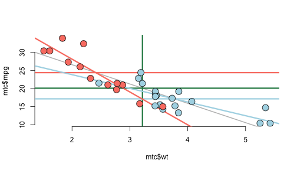

# An Analysis of the Effect of Manual vs Automatic Transmissions on Gas Mileage for a Sample of Cars Build in 1973 and 1974
## Todd Flanders
### May 23, 2015
========================================================

## Executive Summary
We wish to answer the following questions:
- Were manual transmissions or automatic transmissions better for gas mileage in 1974?
- What is difference measured in miles per gallon?
- What confidence do we have that our calulations represent the entire population of vehicles manufatured in 1973 and 1974?

This report analyzes data from the 1974 Motor Trend US magazine, and comprises fuel consumption and 10 aspects of automobile design and performance for 32 automobiles (1973–74 models).  We have a small sample of 32 cars.  19 have automatic transmissions, and 13 have manual transmissions.

## Conclusion
Although there is great desire to answer the gas milage question with certainty, the data does not lead to an indubitable conclusion.  Although correlations are strong and P-values are significant, the input data does not give confidence that the resulting model represents the population of cars manufactured in 1973 and 1974.  We would like to have multiple vehicles of similar make and model with and without automatic transmissions.  Instead, we have a very small sample which represents a wide variety of passenger, sport, luxury, and muscle cars.

There is some data to indicate that manual transmission are better for mpg overall (perhaps by 7 mpg), and other data to suggest that manual transmissions are better for light vehicles, and automatic transmissions are better for heavier vehicles.  This is highly speculative, because we have little data on heavy vehicles with manual transmissions, and we have little data on light vehicles with automatic transmissions.

## Analysis

### Marginal Values
The average mileage in the sample data is 20 mpg, 24 for vehicles with manual transmissions, and 17 for vehicles with automatic transmissions.  If there are no counfounding effects of other variables, we expect a vehicle with a manual transmission have 7 more miles per gallon than a vehicle with an automatic transmission.

### Potential Confounders
Here is a table showing the analysis of nine aspects of design and their impact on mpg for cars with automatic or manual transmissions.  The data is sorted by best model fit to worse model fit according to the r^2 statistic:

<!-- html table generated in R 3.1.1 by xtable 1.7-4 package -->
<!-- Sat May 23 23:25:13 2015 -->
<table border=1>
<tr> <th>  </th> <th> meanX </th> <th> mpg@meanManual </th> <th> mpg@meanAuto </th> <th> icTotal </th> <th> beta1Total </th> <th> icManual </th> <th> beta1Manual </th> <th> icAuto </th> <th> beta1Auto </th> <th> r^2 </th> <th> cor </th>  </tr>
  <tr> <td align="right"> wt </td> <td align="right"> 3.2172 </td> <td align="right"> 17.0681 </td> <td align="right"> 19.2358 </td> <td align="right"> 37.2851 </td> <td align="right"> -5.3445 </td> <td align="right"> 46.2945 </td> <td align="right"> -9.0843 </td> <td align="right"> 31.4161 </td> <td align="right"> -3.7859 </td> <td align="right"> 0.7528 </td> <td align="right"> -0.8677 </td> </tr>
  <tr> <td align="right"> cyl </td> <td align="right"> 6.1875 </td> <td align="right"> 20.7487 </td> <td align="right"> 18.6487 </td> <td align="right"> 37.8846 </td> <td align="right"> -2.8758 </td> <td align="right"> 41.0489 </td> <td align="right"> -3.2809 </td> <td align="right"> 30.8735 </td> <td align="right"> -1.9757 </td> <td align="right"> 0.7262 </td> <td align="right"> -0.8522 </td> </tr>
  <tr> <td align="right"> disp </td> <td align="right"> 230.7219 </td> <td align="right"> 19.2447 </td> <td align="right"> 18.7929 </td> <td align="right"> 29.5999 </td> <td align="right"> -0.0412 </td> <td align="right"> 32.8661 </td> <td align="right"> -0.0590 </td> <td align="right"> 25.1571 </td> <td align="right"> -0.0276 </td> <td align="right"> 0.7183 </td> <td align="right"> -0.8476 </td> </tr>
  <tr> <td align="right"> hp </td> <td align="right"> 146.6875 </td> <td align="right"> 23.2269 </td> <td align="right"> 17.9502 </td> <td align="right"> 30.0989 </td> <td align="right"> -0.0682 </td> <td align="right"> 31.8425 </td> <td align="right"> -0.0587 </td> <td align="right"> 26.6248 </td> <td align="right"> -0.0591 </td> <td align="right"> 0.6024 </td> <td align="right"> -0.7762 </td> </tr>
  <tr> <td align="right"> drat </td> <td align="right"> 3.5966 </td> <td align="right"> 20.7820 </td> <td align="right"> 18.5671 </td> <td align="right"> -7.5246 </td> <td align="right"> 7.6782 </td> <td align="right"> -7.8544 </td> <td align="right"> 7.9621 </td> <td align="right"> 2.1084 </td> <td align="right"> 4.5762 </td> <td align="right"> 0.4640 </td> <td align="right"> 0.6812 </td> </tr>
  <tr> <td align="right"> vs </td> <td align="right"> 0.4375 </td> <td align="right"> 23.5219 </td> <td align="right"> 17.5406 </td> <td align="right"> 16.6167 </td> <td align="right"> 7.9405 </td> <td align="right"> 19.7500 </td> <td align="right"> 8.6214 </td> <td align="right"> 15.0500 </td> <td align="right"> 5.6929 </td> <td align="right"> 0.4409 </td> <td align="right"> 0.6640 </td> </tr>
  <tr> <td align="right"> carb </td> <td align="right"> 2.8125 </td> <td align="right"> 24.6346 </td> <td align="right"> 16.9814 </td> <td align="right"> 25.8723 </td> <td align="right"> -2.0557 </td> <td align="right"> 30.7962 </td> <td align="right"> -2.1908 </td> <td align="right"> 23.1520 </td> <td align="right"> -2.1940 </td> <td align="right"> 0.3035 </td> <td align="right"> -0.5509 </td> </tr>
  <tr> <td align="right"> gear </td> <td align="right"> 3.6875 </td> <td align="right"> 27.8047 </td> <td align="right"> 19.5052 </td> <td align="right"> 5.6233 </td> <td align="right"> 3.9233 </td> <td align="right"> 45.8550 </td> <td align="right"> -4.8950 </td> <td align="right"> 1.2767 </td> <td align="right"> 4.9433 </td> <td align="right"> 0.2307 </td> <td align="right"> 0.4803 </td> </tr>
  <tr> <td align="right"> qsec </td> <td align="right"> 17.8487 </td> <td align="right"> 25.7412 </td> <td align="right"> 16.6663 </td> <td align="right"> -5.1140 </td> <td align="right"> 1.4121 </td> <td align="right"> -23.5205 </td> <td align="right"> 2.7600 </td> <td align="right"> -9.0099 </td> <td align="right"> 1.4385 </td> <td align="right"> 0.1753 </td> <td align="right"> 0.4187 </td> </tr>
   </table>

The top three variables listed seem to make sense.  We should expect heavy cars with big engines to get worse milage than light cars with small engines.  Let's look at the most important relationship, vehicle weight.

### wt -- weight in thousands of pounds

It's no surprise that weight has the biggest impact on fuel efficiency.  More than 75% of the variance of the data is explained by weight.  

The average vehicle weight is 3217 pounds.  This is represented by the vertical green line.  The horizontal pink line represents the marginal mileage of vehicles with manual transmissions, and the horizontal blue line represents the marginal mileage for vehicles with automatic transmissions.  The grey diagonal line represents the expected mpg for a car at a given weight, unadjusted for automatic vs manual transmission.  The pink line is the expected mpg for a car with a manual transmission at a given weight.  The blue line is the expected mpg for a car with an automatic transmission at a given weight.

 

We see an immediate problem in the data.  We do not have a good representation of light cars with automatic transmissions, nor for heavy cars with manual transmissions.  The data is clearly biased and unreliable.  See appendix 1 for analysis on other variables.

The following residual plot shows that there is no obvious pattern for residuals based on the model that predicts mpg based on vehicle weight.  We will therefore not look for interacting variables to tighten up our parsimonious model of simple linear regression using weight and transmission type.

 

Our three outliers are the Merc 240D, the Fiat 128 and the Toyota Corolla.  See appendix 2 for an adjusted model eliminating these outliers.  The model still has the same problem as the original.  We do not have a good representation of vehicles with different transmission types and varying weights in the original data.

I was tempted to continue eliminating data until I got the model I wanted, but the only thing worse than not having the data I need is ignoring data that I have.

## Appendix 1 -- Alternative Confounders

We selected weight as the best determination of expected miles per gallon.  Here is the analysis of variables that we did not use.

### Figure 1  -- number of cylinders

 

### Figure 2 -- engine displacement in cubic inches

 

### Figure 3 -- Gross horsepower

 

### Figure 4 -- Rear axle ratio

 

### Figure 5 -- Engine configuration (V vs Straight)

 

### Figure 6 -- Number of carburators

 

### Figure 7 -- Number of forward gears

 

### Figure 8 -- 1/4 mile time

 

## Appendix 2 -- Adjusted model eliminating the outliers Merc 240D, the Fiat 128 and the Toyota Corolla.

 

<link href="css/proj.css" rel="stylesheet">

