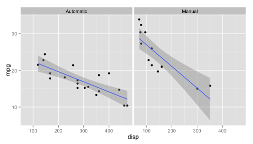

# An Analysis of the Effect of Manual vs Automatic Transmissions on Gas Mileage for a Sample of Cars Build in 1973 and 1974
## Todd Flanders
### May 12, 2015
========================================================


## Executive Summary
Were manual transmissions or automatic transmissions better for gas mileage in 1974?

This report analyzes data from the 1974 Motor Trend US magazine, and comprises fuel consumption and 10 aspects of automobile design and performance for 32 automobiles (1973–74 models).  We have a small sample of 32 cars.  19 have automatic transmissions, and 13 have manual transmissions.

## Analysis
Here is a table showing the analysis of nine aspects of design and their impact on mpg for cars with automatic or manual transmissions:

<!-- html table generated in R 3.1.1 by xtable 1.7-4 package -->
<!-- Tue May 12 14:58:39 2015 -->
<table border=1>
<tr> <th>  </th> <th> meanX </th> <th> mpg@mean </th> <th> mpg@meanManual </th> <th> mpg@meanAuto </th> <th> icTotal </th> <th> beta1Total </th> <th> icManual </th> <th> beta1Manual </th> <th> icAuto </th> <th> beta1Auto </th> <th> r^2 </th> <th> cor </th>  </tr>
  <tr> <td align="right"> wt </td> <td align="right"> 3.2172 </td> <td align="right"> 20.0906 </td> <td align="right"> 17.0681 </td> <td align="right"> 19.2358 </td> <td align="right"> 37.2851 </td> <td align="right"> -5.3445 </td> <td align="right"> 46.2945 </td> <td align="right"> -9.0843 </td> <td align="right"> 31.4161 </td> <td align="right"> -3.7859 </td> <td align="right"> 0.7528 </td> <td align="right"> -0.8677 </td> </tr>
  <tr> <td align="right"> cyl </td> <td align="right"> 6.1875 </td> <td align="right"> 20.0906 </td> <td align="right"> 20.7487 </td> <td align="right"> 18.6487 </td> <td align="right"> 37.8846 </td> <td align="right"> -2.8758 </td> <td align="right"> 41.0489 </td> <td align="right"> -3.2809 </td> <td align="right"> 30.8735 </td> <td align="right"> -1.9757 </td> <td align="right"> 0.7262 </td> <td align="right"> -0.8522 </td> </tr>
  <tr> <td align="right"> disp </td> <td align="right"> 230.7219 </td> <td align="right"> 20.0906 </td> <td align="right"> 19.2447 </td> <td align="right"> 18.7929 </td> <td align="right"> 29.5999 </td> <td align="right"> -0.0412 </td> <td align="right"> 32.8661 </td> <td align="right"> -0.0590 </td> <td align="right"> 25.1571 </td> <td align="right"> -0.0276 </td> <td align="right"> 0.7183 </td> <td align="right"> -0.8476 </td> </tr>
  <tr> <td align="right"> hp </td> <td align="right"> 146.6875 </td> <td align="right"> 20.0906 </td> <td align="right"> 23.2269 </td> <td align="right"> 17.9502 </td> <td align="right"> 30.0989 </td> <td align="right"> -0.0682 </td> <td align="right"> 31.8425 </td> <td align="right"> -0.0587 </td> <td align="right"> 26.6248 </td> <td align="right"> -0.0591 </td> <td align="right"> 0.6024 </td> <td align="right"> -0.7762 </td> </tr>
  <tr> <td align="right"> drat </td> <td align="right"> 3.5966 </td> <td align="right"> 20.0906 </td> <td align="right"> 20.7820 </td> <td align="right"> 18.5671 </td> <td align="right"> -7.5246 </td> <td align="right"> 7.6782 </td> <td align="right"> -7.8544 </td> <td align="right"> 7.9621 </td> <td align="right"> 2.1084 </td> <td align="right"> 4.5762 </td> <td align="right"> 0.4640 </td> <td align="right"> 0.6812 </td> </tr>
  <tr> <td align="right"> vs </td> <td align="right"> 0.4375 </td> <td align="right"> 20.0906 </td> <td align="right"> 23.5219 </td> <td align="right"> 17.5406 </td> <td align="right"> 16.6167 </td> <td align="right"> 7.9405 </td> <td align="right"> 19.7500 </td> <td align="right"> 8.6214 </td> <td align="right"> 15.0500 </td> <td align="right"> 5.6929 </td> <td align="right"> 0.4409 </td> <td align="right"> 0.6640 </td> </tr>
  <tr> <td align="right"> carb </td> <td align="right"> 2.8125 </td> <td align="right"> 20.0906 </td> <td align="right"> 24.6346 </td> <td align="right"> 16.9814 </td> <td align="right"> 25.8723 </td> <td align="right"> -2.0557 </td> <td align="right"> 30.7962 </td> <td align="right"> -2.1908 </td> <td align="right"> 23.1520 </td> <td align="right"> -2.1940 </td> <td align="right"> 0.3035 </td> <td align="right"> -0.5509 </td> </tr>
  <tr> <td align="right"> gear </td> <td align="right"> 3.6875 </td> <td align="right"> 20.0906 </td> <td align="right"> 27.8047 </td> <td align="right"> 19.5052 </td> <td align="right"> 5.6233 </td> <td align="right"> 3.9233 </td> <td align="right"> 45.8550 </td> <td align="right"> -4.8950 </td> <td align="right"> 1.2767 </td> <td align="right"> 4.9433 </td> <td align="right"> 0.2307 </td> <td align="right"> 0.4803 </td> </tr>
  <tr> <td align="right"> qsec </td> <td align="right"> 17.8487 </td> <td align="right"> 20.0906 </td> <td align="right"> 25.7412 </td> <td align="right"> 16.6663 </td> <td align="right"> -5.1140 </td> <td align="right"> 1.4121 </td> <td align="right"> -23.5205 </td> <td align="right"> 2.7600 </td> <td align="right"> -9.0099 </td> <td align="right"> 1.4385 </td> <td align="right"> 0.1753 </td> <td align="right"> 0.4187 </td> </tr>
   </table>

We will eliminate data for rear axle ratio, since we do not have a good spread of data across manual and automatic transmissions.  In the mtcars data set, the automatic transmissions were geared lower for torque, which should be better for mpg. The manual transmissions were geared higher for horsepower, when should be worse for mpg.  Since there is little overlap of the data, we cannot trust that a generated model reflects the entire population of cars.  We don't know what we would observe if we had cars with automatic transmissions and rear-ends geared for horsepower, and cars with manual transmissions geared for torque.  It is better to disregard the rear axle ration data in the mtcars data set.


```r
library(ggplot2)
p <- ggplot(data=mtcars, aes(x=drat, y=mpg))
p + geom_point() + geom_smooth(method = "lm") + facet_grid(. ~ am)
```

 

Car weights have the greatest correlation with mpg.  In general, heavier cars have the lowest mpg.


```r
cor(mtcars$mpg, mtcars$wt)
```

```
## [1] -0.8676594
```

```r
fit <- lm(mpg~wt, data=mtcars)
summary(fit)
```

```
## 
## Call:
## lm(formula = mpg ~ wt, data = mtcars)
## 
## Residuals:
##     Min      1Q  Median      3Q     Max 
## -4.5432 -2.3647 -0.1252  1.4096  6.8727 
## 
## Coefficients:
##             Estimate Std. Error t value Pr(>|t|)    
## (Intercept)  37.2851     1.8776  19.858  < 2e-16 ***
## wt           -5.3445     0.5591  -9.559 1.29e-10 ***
## ---
## Signif. codes:  0 '***' 0.001 '**' 0.01 '*' 0.05 '.' 0.1 ' ' 1
## 
## Residual standard error: 3.046 on 30 degrees of freedom
## Multiple R-squared:  0.7528,	Adjusted R-squared:  0.7446 
## F-statistic: 91.38 on 1 and 30 DF,  p-value: 1.294e-10
```

```r
p <- ggplot(data=mtcars, aes(x=wt, y=mpg))
p + geom_point() + geom_smooth(method = "lm") + facet_grid(. ~ am)
```

 

TODO:  plot residuals to see if we have a pattern.  It looks like we do.  Grumble.  It seems we don't have a pattern if we lump automatic and manual together, but for manuals alone it seems heavier cars get less mpg.

TODO:  see if there is correlation between the predictor and the residuals.  We should if there is a pattern, otherwise should be close to zero.


```r
p <- ggplot(data=mtcars, aes(x=wt, y=resid(fit)))
p + geom_point() + geom_smooth(method = "lm")
```

 

```r
p <- ggplot(data=mtcars, aes(x=wt, y=resid(fit)))
p + geom_point() + geom_smooth(method = "lm") + facet_grid(. ~ am)
```

 

```r
cov(fit$residuals, mtcars$wt)
```

```
## [1] -2.237513e-16
```


TODO: analyze weight against other variables to see if we have patterns (weightMultiVar.Rmd).

TODO:  Final plot that predicts mpg differences between automatic an manual transmissions.  Perhaps a table for each car as well.


<link href="css/proj.css" rel="stylesheet">


